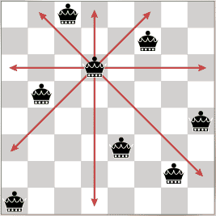

# Parallel Computing with Pthreads

Portability is written with P of POSIX (Portable Operating System Interface), which is a registered trademark and a set of standards specified by the IEEE to maintain compatibility between different operating systems. The name POSIX was suggested by Richard Stallman. It is expected to be pronounced pahz-icks, as in positive, not poh-six, or other variations.

A Thread is specified by the POSIX Base Definitions as:
_A single flow of control within a process. Each thread has its own thread ID, scheduling priority and policy, errno value, thread-specific key/value bindings, and the required system resources to support a flow of control. Anything whose address may be determined by a thread, including but not limited to static variables, storage obtained via malloc(), directly addressable storage obtained through implementation-defined functions, and automatic variables, are accessible to all threads in the same process_.

Pthreads is the short notation of POSIX Threads. It is an execution model that specifies how work takes place, and it allows a program to manage multiple flows of work (aka threads) that overlap in time. POSIX Threads is an API defined by the standard IEEE POSIX 1003.1c.
In Pthreads programs, all the running threads can access global variables. This is a common approach to develop a threaded program, so all threads can access the values in an easier way than defining a data structure and passing it as a parameter to a thread. While all global variables are shared, all local variables are kept private to the running thread.


## The Pthreads API

The Pthreads API is used to implement shared memory parallelism. Implementations of the API are available in many UNIX based operating systems that are POSIX-conformant (Linux, macOS, Solaris, et al.) and it is normally included as a library named libpthread. For instance, this library is present under /usr/lib directory as libpthread.dylib which is a symbolic link to libSystem.dylib in macOS. One way to validate if an operating system supports Pthreads is with the gcc compiler using the following command:

```
$ gcc --version

Configured with: --prefix=/Applications/Xcode.app/Contents/Developer/usr --with-gxx-include-dir=/Applications/Xcode.app/Contents/Developer/Platforms/MacOSX.platform/Developer/SDKs/MacOSX10.12.sdk/usr/include/c++/4.2.1
Apple LLVM version 8.0.0 (clang-800.0.42.1)
Target: x86_64-apple-darwin16.3.0
Thread model: posix
InstalledDir: /Applications/Xcode.app/Contents/Developer/Toolchains/XcodeDefault.xctoolchain/usr/bin
```

> Command executed on a MacBook Pro, Intel Core i7 2.3 GHz, 4 cores, 256 KB L2 per core, 6 MB L3

If the command doesn’t display the Thread model, an alternative is using the command `find /usr/lib -name 'libpthread.*' -print` to find the library.

The `pthread.h` header file shall be included in order to implement Pthreads in a program. Adding the option `−lpthread` may be necessary when compiling a program.

The current standard of the Pthreads API is for the C language and it defines a collection of types, constants and functions all prefixed with `pthread_` and the main name conventions are:

- `pthread_     ` Main thread routines for threads management (create, join, exit, et al.)
- `pthread_attr_` Attributes objects routines
- `pthread_mutex_` Mutex Routines 
- `pthread_mutexattr_`    Mutex attributes objects routines
- `pthread_cond_`	    Condition variables routines
- `pthread_condattr_`	    Condition variables attributes objects

- `pthread_rwlock_`	    Read/write lock routines

Pthreads functions are categorized as Thread Routines, Attribute Object Routines, Mutex Routines, Condition Variable Routines, Read/Write Lock Routines, Per-Thread Context Routines and Cleanup Routines. All these routines and more detailed information can be found on the Library Functions Manual by executing the command `man pthread`.

## Examples

#### [holamigos.c](holamigos.c)

An “advanced” implementation of the classic “Hello, World” program using the main Pthreads functions to create, identify and synchronize the threads. It creates four threads by default, and optionally the number of threads to be created can be passed as a command-line parameter when executing the program.

Compilation<br>
 `gcc -Wall -lpthread -o holamigos holamigos.c`

Execution<br> 
 `./holamigos [number_of_threads]`

Execution example

```
$ ./holamigos 7

Hola amigos! I'm the main thread
Hello peers! I'm thread 3 of 7. My ID is 169263104
Hello peers! I'm thread 1 of 7. My ID is 168189952
Aloha honua! I'm thread 2 of 7. My ID is 168726528
Hola amigos! I'm thread 4 of 7. My ID is 169799680
Hello peers! I'm thread 5 of 7. My ID is 170336256
Hello peers! I'm thread 7 of 7. My ID is 171409408
Hallo Leute! I'm thread 6 of 7. My ID is 170872832
```

#### [pythagoras.c](pythagoras.c)

The Pythagoras' theorem states the relation among the three sides of a right-angled triangle, where the sum of the areas of the two squares on the sides (a, b) equals the area of the square on the hypotenuse (c), and it can be represented with the equation a2 + b2 = c2 as shown in the following image:


The program uses two threads; each one to calculate the areas of the two squares on the sides. Initially, the hypotenuse value is set to zero. When one thread has made its calculation, it sums it to the hypotenuse, therefore it has to be treated as a pthread critical section. It uses mutex to protect the shared data. To compile, it may be necessary to add the option -lm to link the math.h library.

Compilation<br>
`gcc -lm -Wall -lpthread -o pythagoras pythagoras.c`

Execution<br>
`./pythagoras <side_a> <side_b>`

Execution example

```
$ ./pythagoras 3.5 4.5

Pythagoras' theorem | a^2 + b^2 = c^2
3.50^2 = 12.25
4.50^2 = 20.25
Hypotenuse is 5.70
```

#### [queens_pth.c](queens_pth.c)

The Eight Queens Puzzle is a classic strategy game problem that consists of a chessboard and eight chess queens. Following the chess game’s rules, the objective is to situate the queens on  the board in such a way that all of them are safe, this means that no queen can attack each other as shown in the following image:



The puzzle was originally described by the chess composer Max Bezzel and extended by Franz Nauck to be a N-Queens Puzzle, with N queens on a chessboard of  N×N squares. Many mathematicians and computer scientists have worked on defining methods to solve the puzzle. A classic algorithm to be studied/implemented by computer science students.

This queens problem can be computationally expensive. The bigger the board, the bigger the possible solutions to situate the queens on it. Two versions have been implemented to compare performance, with and without pthreads and using backtracking to solve the the problem. To compile, it may be necessary to add the option -D_BSD_SOURCE to be able to use the timing functions.

Compilation (without pthreads)<br>
`gcc -D_BSD_SOURCE -o queens queens.c`

Execution<br>
`./queens [number_of_queens]`

Execution example
```
$ ./queens 14

Elapsed time: 16.050736
There are 365596 solutions for 14 queens. Here's one of them:

+  +  +  +  +  +  +  +  +  +  +  +  +  Q
+  +  +  +  +  +  +  +  +  +  +  Q  +  +
+  +  +  +  +  +  +  +  +  Q  +  +  +  +
+  +  +  Q  +  +  +  +  +  +  +  +  +  +
Q  +  +  +  +  +  +  +  +  +  +  +  +  +
+  +  Q  +  +  +  +  +  +  +  +  +  +  +
+  +  +  +  +  +  +  +  Q  +  +  +  +  +
+  +  +  +  +  +  +  +  +  +  +  +  Q  +
+  Q  +  +  +  +  +  +  +  +  +  +  +  +
+  +  +  +  +  +  +  Q  +  +  +  +  +  +
+  +  +  +  +  Q  +  +  +  +  +  +  +  +
+  +  +  +  +  +  +  +  +  +  Q  +  +  +
+  +  +  +  +  +  Q  +  +  +  +  +  +  +
+  +  +  +  Q  +  +  +  +  +  +  +  +  +
```

Compilation (with pthreads)<br>
`gcc -D_BSD_SOURCE -Wall -lpthread -o queens_pth queens_pth.c`

Execution<br> 
`./queens_pth [number_of_queens] [number_of_threads]`

Execution examples
```
$ ./queens_pth 14 4

Elapsed time: 5.066732
There are 365596 solutions for 14 queens.

$ ./queens_pth 14 14

Elapsed time: 3.768640
There are 365596 solutions for 14 queens.
```
